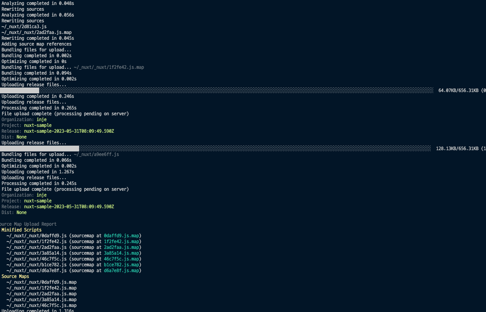
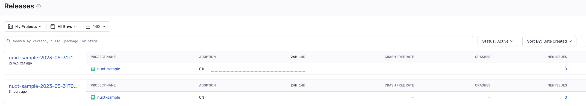

# Nuxt + Sentry

## nuxt/sentry 공식 사이트

- https://sentry.nuxtjs.org/getting-started/setup

## 설치

- npm을 통한 설치
  ```
  npm install @nuxtjs/sentry
  ```
- nuxt.config.js
  ```js
  {
    modules: [
      '@nuxtjs/sentry'
    ],
    sentry: {
      dsn: '', // Enter your project's DSN.
      // Additional module options go here.
    }
  }
  ```
- Types : tsconfig.json
  ```json
  {
    "compilerOptions": {
      // ...
      "types": ["@nuxtjs/sentry"]
    }
  }
  ```

## dsn 발급

- [sentry](https://sentry.io/) 가입
  - 해당 플랫폼 선택
    - nuxt가 따로 없기 때문에 vue로 선택
  - dsn 값 확인
    - Settings → Projects -> 해당 프로젝트 선택
    - SDK SETUP → Client Keys(DSN)
  - dsn이 발급되면 nuxt.config.js에 설정 추가

## 테스트 코드

- pages/index.vue

```js
  async asyncData({ params, $sentry }) {
    try {
      setTimeout(() => {
        throw new Error('에러 발생...!!');
      }, 1000)
    } catch (error) {
      $sentry.captureException(error);
    }
  },
```

## Release 설정

### 참고

- https://sentry.nuxtjs.org/configuration/options/#publishrelease
- https://docs.sentry.io/product/releases/

### npm package 설치

```
npm i -D @sentry/webpack-plugin@1.20.0
```

- sentry 버전 7.3.0
  - webpack-plugin 버전 이슈(2.2.0) 있음
  - 1.20.0 버전으로 다운

### dist 폴더 output으로 설정

- nuxt.config.ts

```js
export default {
  ssr: false,
  // ...
};
```

### publishRelease 속성 추가

- nuxt-configs/sentry.ts

```js
import type { ModuleOptions } from "@nuxtjs/sentry";
const { execSync } = require("child_process");
const isRunNuxtBuild = process.env.npm_lifecycle_script.includes('nuxt build');
const SENTRY_STATUS = process.env.SENTRY || "off";

const sentryConfig: ModuleOptions =
  SENTRY_STATUS === "on"
    ? {
        dsn: "",
        publishRelease: {
          authToken: "",
          org: "",
          project: "nuxt-sample",
          include: ["./dist"],
          ignore: ["node_modules"],
          disableClientRelease: !isRunNuxtBuild,
          config: {
              release: ''
          },
        sourceMapStyle: "source-map",
      }
    : {};

  if (SENTRY_STATUS && isRunNuxtBuild) {
    if (sentryConfig.config) {
      sentryConfig.config.release = (() => {
        try {
          return execSync('git describe --abbrev=0 --tags').toString().trim();
        } catch (e) {
          return `javascript-vue8-${new Date().toISOString()}`;
        }
      })();
    }
  }
export const sentry = sentryConfig;
```

- publishRelease
  - authToken
    - 토큰 정보 입력
  - org
    - 조직 이름 입력
  - project
    - 프로젝트 이름 입력
  - include
    - 빌드 시 생성되는 폴더 경로 입력
  - ignore
    - 노드 모듈스 입력
  - release
    - default 설정 원할 시 => release : ''
    - 커밋 ID
    - nuxt dev 모드일 경우
      - 이슈는 등록하되 릴리즈에 등록하지 원하지 않을 경우
        - disableClientRelease : true && config : { release: ''}
- sourceMapStyle
  - Sentry에 릴리스를 게시할 때 생성되는 소스 맵 타입

* nuxt.config.ts

```js
import { sentry } from './nuxt-configs';

export default {
  // ...
  sentry,
};
```

### 토큰

- Setting -> Auth Tokens -> Create New Token

### 테스트

- package.json
  ```json
  "build:dev:sentry": "cross-env RUN_TYPE=dev SENTRY=on nuxt build",
  ```
- 
- 

### sourcemap 삭제

- fast-glob 설치

  ```
  npm i -D fast-glob
  ```

- 스크립트 파일 생성

  - scripts/postbuild.js

    ```js
    const fs = require('fs');
    const fastGlob = require('fast-glob');

    // Delete sourcemaps
    const mapFiles = fastGlob.sync('./dist/**/*.js.map');
    mapFiles.forEach((filePath) => {
      try {
        fs.unlinkSync(filePath);
      } catch (err) {
        console.error('Fail Delete sourcemaps', err);
      }
    });

    // Delete sourcemaps refs
    const jsFiles = fastGlob.sync('./dist/**/*.js');
    jsFiles.forEach((filePath) => {
      try {
        const fileContent = fs.readFileSync(filePath, 'utf8');
        fs.writeFileSync(
          filePath,
          fileContent.replace(/\/\/# sourceMappingURL=\S+/g, '')
        );
      } catch (err) {
        console.error('Fail Delete sourcemaps refs', err);
      }
    });
    ```

- package.json
  ```json
  {
    "scripts": {
      // ...
      "build:dev:sentry": "cross-env RUN_TYPE=dev SENTRY=on nuxt build && npm run clear:sourcemap",
      "clear:sourcemap": "node ./scripts/postbuild.js"
    }
  }
  ```
